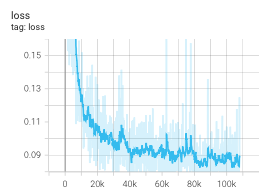
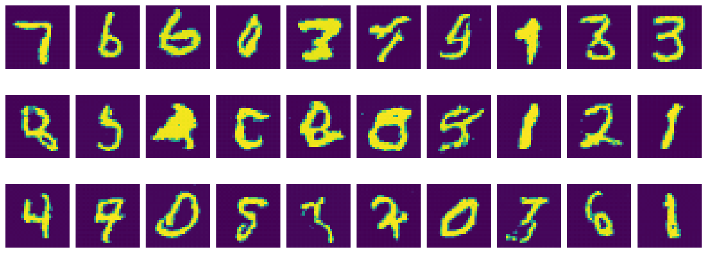

# Rectified Flow 实现

这个项目实现了Flow Matching (FM) 技术，用于图像生成任务。项目包含了DiT (Diffusion Transformer) 模型的实现，并在MNIST数据集上进行了训练和推理。

## 项目结构

- `train.py`: 训练脚本，使用MNIST数据集训练模型
- `dit.py`: DiT (Diffusion Transformer) 模型的实现
- `flowmatching.py`: Flow Matching 技术的实现
- `infer.ipynb`: 推理脚本，用于生成新图像
- `coupling.ipynb`: 耦合数据集训练示例 (MNIST到FashionMNIST)
- `output.png`: 训练结果示例图像
- `traj.png`: 图像生成轨迹示例

## 技术细节

### DiT (Diffusion Transformer) 模型

项目实现了DiT模型，包含以下主要组件：

- `DiTBlock`: DiT的基本构建块，包含注意力机制和MLP
- `FinalLayer`: 最终输出层
- `PatchEmbd`: 图像块嵌入层
- 位置编码和时间编码函数

### Flow Matching

Flow Matching技术通过学习从噪声到数据的向量场来生成图像。主要功能包括：

- `get_train_tuple`: 生成训练数据对
- `sample_ode`: 通过ODE求解器采样生成图像

## 使用方法

### 训练模型

```bash
python train.py --epochs 30 --batch_size 16 --lr 2e-4
```

训练脚本将使用MNIST数据集训练DiT模型，并将检查点保存在`./checkpoints/`目录中。

### 推理生成

使用`infer.ipynb` Jupyter笔记本进行推理，加载训练好的模型并生成新图像。

## Loss



## 结果展示




## 依赖

- PyTorch
- torchvision
- timm
- tqdm
- tensorboard

## 参考

- [Flow Matching for Generative Modeling](https://arxiv.org/abs/2210.02747)
- [Scalable Diffusion Models with Transformers](https://arxiv.org/abs/2212.09748)
